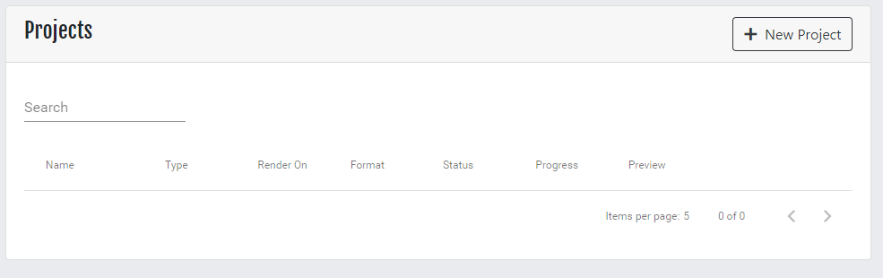

For this section we'll be using the BMW demo by Mike Pan. Download it using the following link.

https://download.blender.org/demo/test/BMW27_2.blend.zip

Extract the files and place there where you can access them later.

### Projects Screen
From the main menu select **Projects**. This will bring up the projects main screen.

In order to create a new project select the **New Project** button located in the upper right hand corner of the project screen.

This will open the **Create Project Wizard**.

## Create Project Wizard
### Upload Project

The first screen is the Project Upload screen.  From here you will upload .blend files and zip files.

Clicking on the **Choose** button will bring up an Open Dialog.  Find and select any one of the two bmw27 blend files.

**Note:** You can select whichever file. Sethlans will control whether the CPU or GPU is used.

Click on the button with the name of the file in order to upload it to the Sethlans server.

### Project Details

* Project Name - Name of the project in Sethlans
* Blender Version - Dropdown list of installed Blender versions on server
* Output Format - Render Output Format.  PNG for Still Image. PNG, AVI, MP4 for Animations.
* Project Type - Still Image and Animation are the available options.
* Start Frame - First frame to be rendered.  For Still Image this is the frame of the image you wish to render.  By default frame 1 is used.
* End Frame - Last frame to be rendered.  Available only when Animation is selected.
* Frame Step - Number of frames to advance animation.  By default this is 1. Allows you to skip frames in animations.

### Render Settings

* Rendering Engine - Choice of Blender Render and Cycles.
* Render On - Rendering Method.  Project can be CPU only, GPU only and CPU & GPU. 
* Samples (Cycles Only) - Number of samples to render with.
* Render Resolution - Resolution used for rendering dimensions
* Render Image Scaling - This is a percentage of of the above setting.  Useful for a test render where you can set to a lower percentage for faster rendering.
* Use Parts - Breaks a frame into parts
* Number of Parts - Number of pieces of a frame that will then be sent to nodes to render.   Range is from 4 to 144. (Square root numbers starting from 4)

### Summary

Once all selections have been made you'll be presented with a summary that you can review before submitting it to the server.  

