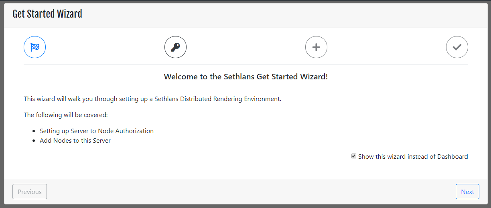
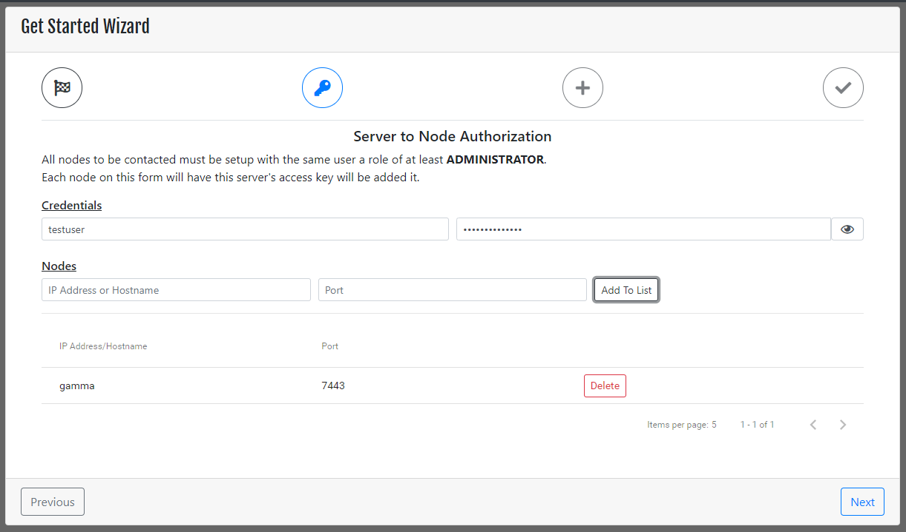
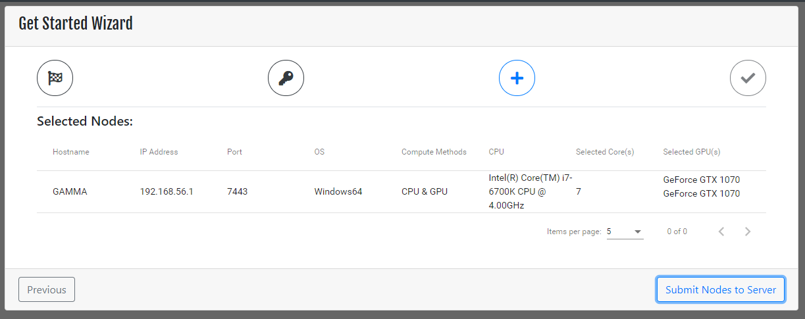
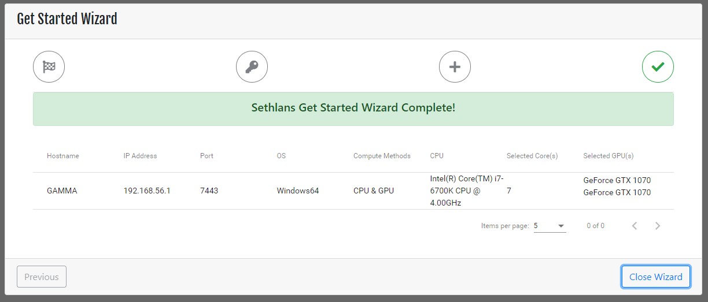

After the Sethlans initial installation, log in with the administrative user.  The Get Started Wizard will be displayed.

This wizard covers two major parts of adding nodes to Sethlans for rendering.
* Server to Node Authorization
* Node Addition

### Server to Node Authorization
Instead of passing usernames and passwords around a server key is used.  This key must be present on a node in order to add the node to that server.

This prevents nodes from being added to any server without permission, as well as eliminates the need to supply usernames and passwords.

### Node Addition
A node needs to be added to a server before projects can render on it.  Once communication is established the server will send a benchmark request in order to gage the strength of the node.  The lower the benchmark score the faster the node.

## Welcome Screen

This screen is displayed after login.  Once the Get Started Wizard has been run it is disabled.  
* Show this wizard instead of Dashboard - Toggles the Get Started Wizard.

## Server to Node Authorization Screen

### Credentials
Administrator account that is present on the **NODES** to be added to the server.
This must be the same account on all nodes for this wizard to work.

### Nodes
A list of nodes to authorize and add to the server. 
Nodes can be added via IP addresses or hostnames and will connect via the port given.

## Node Selection Summary Screen

If the nodes given in the previous list exist and the credentials match, the server will be able to poll the node and obtain it's information.  

* Hostname - Name of the node obtained from the hostname of the computer.
* IP Address - This will be the IP address that the node displays.
* Port - Communication Port of node.
* OS - Operating System of node.
* Compute Methods - The configured compute method for this node.
* CPU - If node compute method is CPU or CPU & GPU, this will be populated
* Selected Core(s) - Cores available for rendering when CPU or CPU & GPU methods are available
* Selected GPU(s) - If node compute method is GPU or CPU & GPU this information will be populated.

## Completion

Once nodes have been submitted and added properly the wizard will display a banner that it has completed.  Clicking on **Close Wizard** will also disable the Get Started Wizard from displaying on login.  

