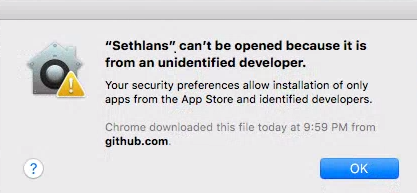
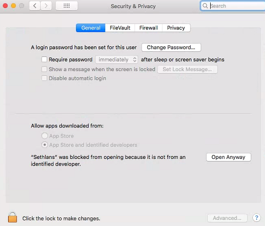
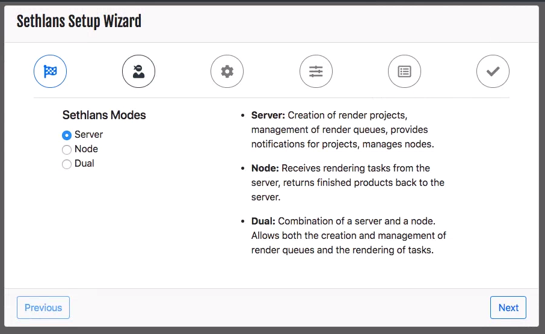

## Windows Initial Setup

 - Double click on the Sethlans Installation executable file. 
 - Windows will prompt to make changes to the system. 
 

 - The default installation path is C:\Program Files\Sethlans
 - Once the installation has completed you have the option to create a shortcut for all users or the current user. 
 
 
 
 - Start Sethlans via the Sethlans shortcut.

## Linux Initial Setup
Depending on whether you will install Sethlans as a **SERVER** or **NODE** there are certain dependencies that will need to be installed in order for Sethlans to function properly. 

The following dependencies are recommended for **NODE** and **DUAL** mode(for Blender to work properly):

- libsdl1.2
- libxxf86vm1
- libgl1-mesa-glx
- libglu1-mesa
- libxi6
- libxrender1
- libxfixes3

The following dependencies are recommended for **SERVER** mode:
- ffmpeg

## macOS Initial Setup
 - Extract Sethlans DMG from downloaded zip file.
 - Open Sethlans DMG.
 - Copy Sethlans to Applications folder
 

 - Double-click on Sethlans
 - Acknowledge the unidentified developer notice
 

 - Navigate to System Preferences > Security and Privacy
 - Click on "Open Anyway"

 - Navigate to Applications. Double-click on Sethlans
 - Click Open
  

## Sethlans Setup
On Windows and macOS systems the Sethlans system tray icon provides a shortcut that automatically opens a browser to Sethlans.

 - The initial port **7443** via **HTTPS**. For example via a browser, navigate to **https://localhost:7443**
 - Once the Sethlans Setup Wizard appears you'll have the option to select a mode.
	 - **SERVER** - Creation of render projects, management of render queues, provides notifications for projects, manages nodes.
	 - **NODE** - Receives rendering tasks from the server, returns finished products back to the server.
	 - **DUAL** - Combination of a server and a node. Allows both the creation and management of render queues and the rendering of tasks.

### Admin Account

 - The wizard will then prompt you to create an admin account to manage Sethlans.  **SERVER** mode will ask for an email address as it has the ability to send email notifications to users.  This option is not available in **NODE**.

### Server Settings

 - **Blender Binary Version**:
	 - The wizard will prompt for an initial Blender version that will be distributed to nodes and associated with projects.
### Node Settings

- **Compute Method**:
	- If a node has a supported graphics card the options of GPU and CPU & GPU mode will be available. Default option is CPU.
- **CPU Settings**:
	- **Rendering Cores** - The number of rendering cores available to Blender.  In CPU & GPU mode the maximum number of cores is reduced by 1 which is reserved to better process GPU rendering requests.
	- **CPU Tile Size** - Size of tiles used for CPU rendering.
- **GPU Settings**:
	- The wizard will present detected and supported GPU devices present in the system.  Multiple GPU's can be selected.
	- **GPU Tile Size** - Size of tiles used for GPU rendering. 
	 - **Combine GPUs**: 
		 - **Enabled** -  All selected GPU's are used during rendering of a single task.
		 - **Disabled** -  Each GPU will be given a task to render individually.
### Settings

- **Network**
    - **IP Address** - Address that is used for communication between Sethlans.  
    - **Port** - Communication port used by Sethlans. Default 7443
    - **Sethlans URL** - Used for email links and communications
- **Advanced**
    - **Sethlans Home Directory** - All Sethlans data and projects will be stored here.
    - **Log Level** - Configures Sethlans log level

### Mail Settings

- **SMTP Server** - Hostname or IP Address of mail server
- **SMTP Port** - Port used to send mail.  Port 25, 465 or 587 are the most common.
- **Reply To Address** - Used to set to a invalid email address or a monitored mailbox.
- **Use SSL** - Use SSL/TLS encryption when connecting to mail server
- **Enable STARTTLS** - Upgrades plan text connections to encryption connections.
- **Require STARTTLS** - Requires the use of the STARTTLS command. If the server doesn't support the STARTTLS command the connection will not be established.
- **Use SMTP AUthentication**
    - **Enabled** - Use a username and password to authentication to SMTP server.
    - **Disabled** - Does not authenticate to SMTP server.

### Summary and Completion

- Review the Summary Page and if satisfied click **Finish**.

  
- Settings will be implemented and Sethlans will restart.  After 30 seconds the login page will be displayed.

