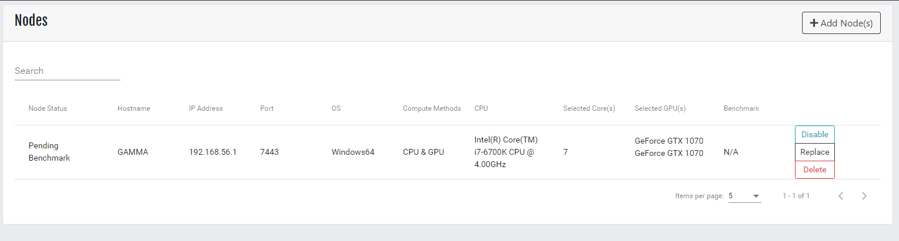
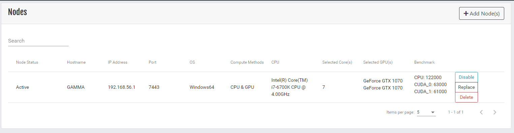

After the Get Started Wizard is completed Sethlans will display the Node screen.  

When a node is added to Sethlans a benchmark request is sent to the node in order to gauge the capabilities of the node.

* Node Status - Current status of a node. Possible values are Pending Benchmark, Active, Disabled, Inactive
* Hostname - Node hostname
* IP Address - Node IP Address
* Port - Node Port
* OS - Node Operating system
* Compute Methods - Configured Compute method
* CPU - If node compute method is CPU or CPU & GPU, this will be populated
* Selected Core(s) - Cores available for rendering when CPU or CPU & GPU methods are available
* Selected GPU(s) - If node compute method is GPU or CPU & GPU this information will be populated.
* Benchmark - Rendering strength of a node.  **Lower scores mean better performance.**

