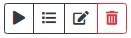
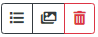
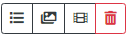

Once the wizard is completed the project BMW Test will be displayed on the Project List page.

## Action Bar
Projects are controlled from the project list screen via the action bar. Depending on the state of the project certain actions will be available.

### Project Added

* Start Project
* Project Details
* Edit Project
* Delete Project

### Project Running

* Pause Project
* Project Details
* Stop Project

### Project Paused

* Resume Project
* Project Details
* Stop Project

### Project Completed - Still Image

* Project Details
* Download Images
* Delete Project

### Project Completed - Animation (MP4/AVI)

* Project Details
* Download Images
* Download Video
* Delete Project

## Project Status
During the lifecycle of a project several states will be displayed
* Added - Project has been added but hasn't been started.
* Pending - Project is waiting to be assigned to a node.
* Started - Project has been assigned to one or more nodes.
* Rendering - Project has received one or more images/parts from nodes.
* Paused - Project is in a Paused state.
* Finished - Project is complete.

Once the project has completed you can download the rendered image.

